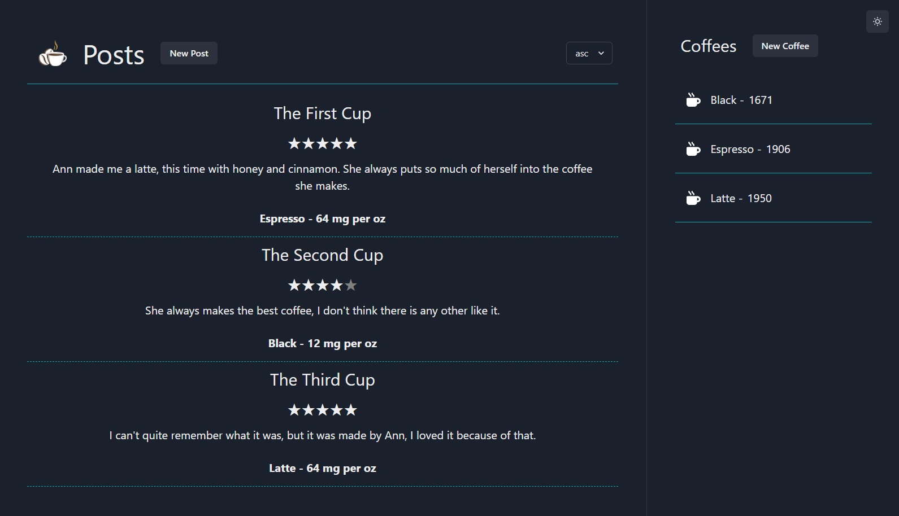

# BlogCafe

_BlogCafe_ is a mock assessment submission for https://github.com/ROTBOW/aA_Mock_TakeHomeChallenge

Please run this project locally in development as production build has not been considered.

## ChallengeReadMe

---

[ChallengeReadMe](ChallengeReadMe.md)

## Technologies Used

---

- Backend: nodeJs, express, sequelize, postgreSQL
- Frontend: Vite, Chakra UI, React, Zustand

## Getting started

---

1.  Clone this repo.

    -        `https://github.com/suwanshree/aA_mock_takehome`

2.  Install dependencies from the backend_challenge directory.

    -        `npm install`

3.  Install dependencies from the frontend_challenge directory.

    -        `npm install`

4.  Create a POSTGRESQL user with CREATEDB and PASSWORD in PSQL.

    -        CREATE USER <name> WITH CREATEDB PASSWORD <'password'>

5.  Create a .env file in the backend directory based on the .env.example found within the same directory.

6.  Enter your username and password information into your .env file along with your desired database name, a secured combination of characters for your JWT_SECRET, and also add 5000 for your PORT.

7.  Create Database, Migrate, and Seed models.

    -       npx dotenv sequelize db:create

    -       npx dotenv sequelize db:migrate

    -       npx dotenv sequelize db:seed:all

8.  Start the services in the backend_challenge directory.

    -       npm start

9.  Start the services in the frontend_challenge directory, which should open the project in your default browser. If not, navigate to [Frontend Server](http://localhost:5173/).

    -       npm run dev

10. You can start using the application and perform CRUD operations.

## Features

---

Users can perform the following actions.

    - Add/View/Delete Coffees

    - Add/View/Delete Posts
